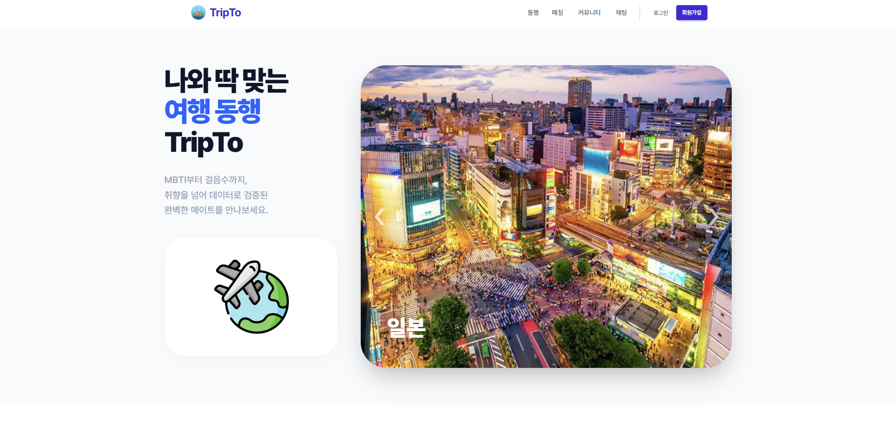
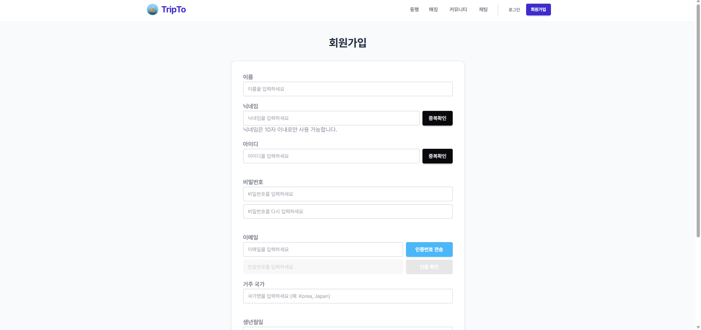
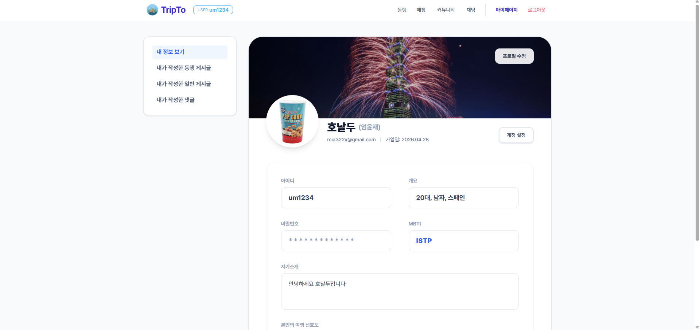
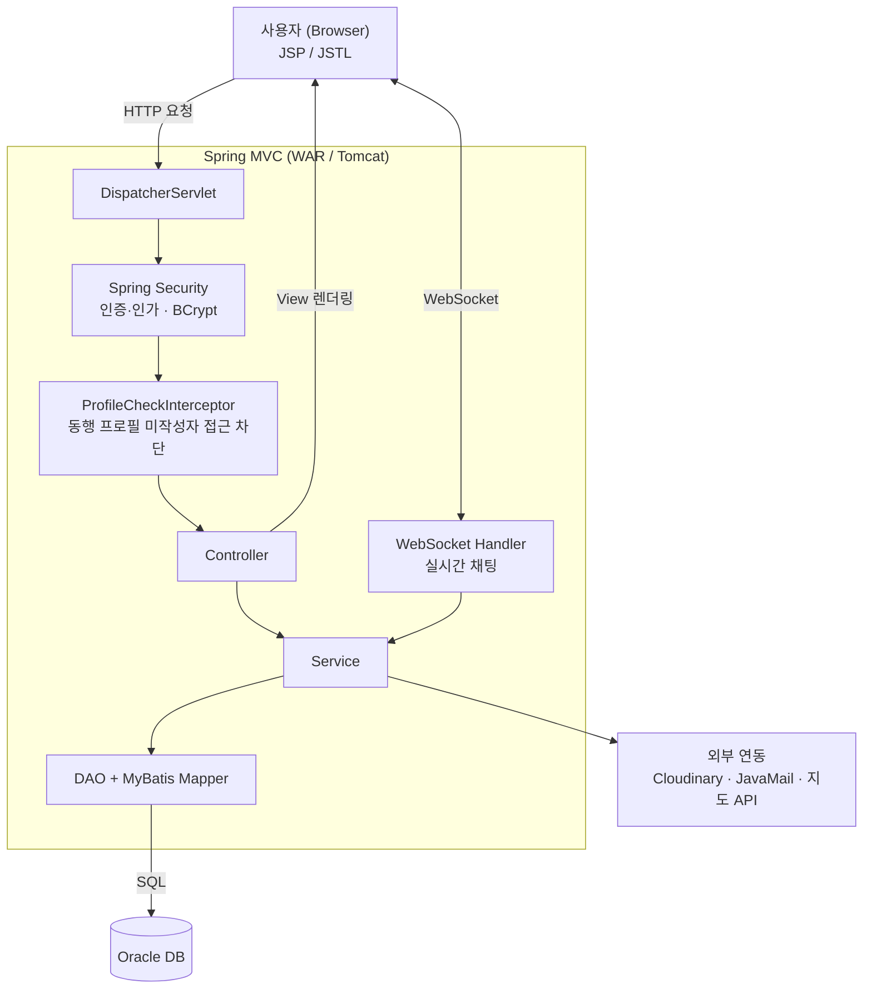
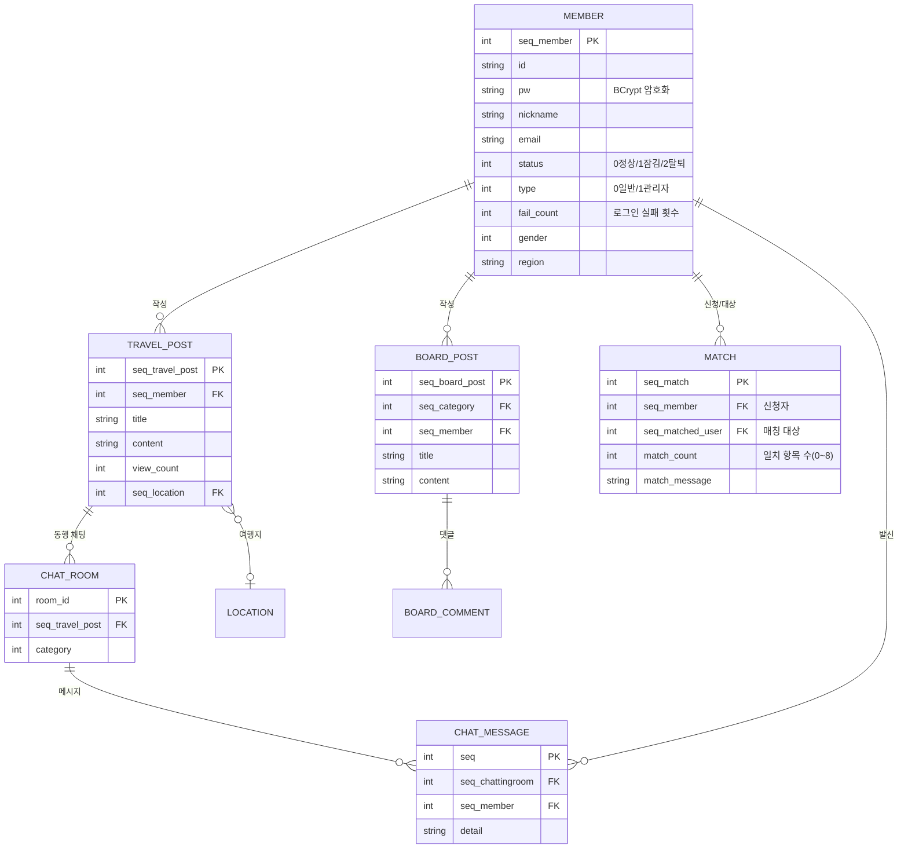

# TripTo

**TripTo**는 여행 스타일과 개성 데이터를 기반으로 **여행 동행자를 매칭**해주는 서비스입니다.
MBTI·활동량·흡연/음주 성향 등 8개 항목의 취향 데이터로 잘 맞는 동행을 추천하고,
동행 게시판·실시간 채팅(일정·투표)·지도 매핑까지 여행 준비의 전 과정을 지원합니다.

**요구분석, 시스템 설계, 기능 구현, 테스트**까지 실제 프로젝트의 전 과정을
팀원 간 협업으로 완성한 학습 프로젝트입니다.


## 📌 프로젝트 개요
- **개발 기간**: 2026.04.16 ~ 2026.04.29
- **실행 환경**: 로컬 실행(WAR / Tomcat, `http://localhost:8080`)
- **담당 역할(황윤재)**: 협업 도구 초기 설정, 회원가입·이메일 인증·로그인/로그아웃, 마이페이지


## 🛠 기술 스택

**Back-End**  


**Data / View**  


**Front-End**  


**Communication**  


- Java 11 / Spring Framework 5.3.9 (Spring MVC) / Maven (WAR)
- Spring Security 5.8.5 (인증·인가, BCrypt 비밀번호 암호화)
- MyBatis 3.5.16 + Oracle (ojdbc8), HikariCP, log4jdbc
- Spring WebSocket (실시간 채팅)
- JSP / JSTL 뷰


## 📦 사용 라이브러리 및 API
- spring-context / spring-webmvc / spring-jdbc / spring-tx
- spring-security (core / config / web / taglibs)
- mybatis, mybatis-spring
- spring-websocket, javax.websocket-api
- javax.mail (이메일 인증), spring-context-support
- commons-fileupload / commons-io (파일 업로드)
- Cloudinary (이미지 호스팅)
- jackson-databind / gson / json-simple
- AspectJ (AOP), Lombok


## 🖼️ 실행 화면

**메인**



**회원가입 / 마이페이지**





## ⚙️ 설치 및 실행 방법

> 실행에는 Oracle DB가 필요하며, DB 접속 정보와 메일/Cloudinary 키는 별도 설정 파일로 주입합니다.

```bash
# WAR 빌드
mvn clean package

# 로컬 Tomcat에 배포하여 실행 (http://localhost:8080)
```


## 🔑 주요 기능

**회원 / 인증 (황윤재 담당)**
- 회원가입 — 이메일 인증(10분 만료·재발송 시 기존 코드 폐기), 아이디·닉네임 중복 확인, 프로필 사진 업로드
- 로그인 / 로그아웃 — Spring Security 기반 인증, 로그인 실패 횟수 누적 및 계정 잠금(status)
- 아이디·비밀번호 찾기 — 이메일 인증
- 마이페이지 — 회원 정보·프로필 수정, 비밀번호 변경, 회원 탈퇴, 내 활동 무한 스크롤 조회

**여행 동행 매칭**
- MBTI·흡연·음주·활동량(걸음수)·선호 숙소·언어·연령대 등 **8개 항목 기반 취향 매칭**
- 일치 항목 수(0~8)로 동행 추천, 매칭 신청·수락

**동행 / 게시판**
- 동행 게시판 · 일반 게시판 CRUD (파일 첨부, 카테고리, 검색, 페이징)
- 댓글, 게시글 신고

**실시간 채팅**
- WebSocket 기반 1:1 채팅
- 채팅방 내 **일정 관리**와 **투표**(카카오톡 투표 형태), 지도 API 매핑

**관리자**
- 회원·게시글·동행 목록 관리, 신고 처리


## 🏗️ 시스템 아키텍처

전형적인 **레거시 Spring MVC 계층형 구조**로, DispatcherServlet → Controller → Service → DAO(MyBatis) → Oracle 흐름을 따릅니다.
인증은 Spring Security가, 동행 프로필 미작성자의 접근 차단은 Interceptor가, 실시간 채팅은 WebSocket이 담당합니다.



- **Spring Security**: URL 패턴별 권한 접근제어 + `BCryptPasswordEncoder` 비밀번호 암호화.
- **Interceptor**: (동행)프로필 미작성자의 매칭·채팅 접근을 컨트롤러 진입 전에 차단해 컨트롤러 로직을 간소화.
- **WebSocket**: 채팅 메시지·일정·투표를 실시간으로 주고받음.


## 🗄️ 데이터 설계

`MEMBER`를 중심으로 게시글·매칭·채팅이 연결되는 구조입니다.
동행 매칭에 쓰이는 취향 데이터(MBTI·활동량 등)를 기준으로 회원 간 적합도를 계산합니다.



- **`MEMBER`** — 회원 정보 및 인증. 상태(status)·유형(type)·로그인 실패 횟수로 계정 상태를 관리.
- **`MATCH`** — 8개 취향 항목의 일치 개수(`match_count`)로 동행 적합도를 표현.
- **`TRAVEL_POST` / `BOARD_POST`** — 동행 게시판·일반 게시판. 파일 첨부·카테고리·조회수 보유.
- **`CHAT_ROOM` / `CHAT_MESSAGE`** — 동행 게시글에 연결된 채팅방과 메시지.


## 🧩 설계 포인트

### Spring Security 중앙 통제
- URL 패턴별 인가 규칙을 보안 설정에 모으고, 비밀번호는 BCrypt로 단방향 암호화하여 저장.

### Interceptor 흐름 제어
- 인증(Security)과 별개로, **동행 프로필 미작성자**의 매칭·채팅 접근을 인터셉터로 사전 차단 → 각 컨트롤러가 프로필 검사 로직을 중복으로 갖지 않도록 함.

### 이메일 인증
- 회원가입·아이디/비밀번호 찾기에 이메일 인증 코드를 사용하고, **10분 만료 및 재발송 시 기존 코드 폐기**로 안전성 확보.


## 👨‍👩‍👧‍👦 팀원 소개

| 이름   | 담당 기능 | Contact |
|--------|-----------|---------|
| 곽정도 | 실시간 채팅·일정/투표, 지도 API 매핑 | joungdo5@gmail.com |
| 이세빈 | 동행 게시판·일반 게시판 CRUD | sule121431@gmail.com |
| 홍태훈 | 여행 동행 매칭, 관리자 | ghdxogns123@gmail.com |
| 황윤재 | 회원가입·이메일 인증·로그인/로그아웃, 마이페이지 | hyz0106@naver.com |
